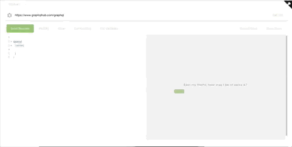

[](https://travis-ci.org/imolorhe/altair)
[](https://ci.appveyor.com/project/imolorhe/altair/branch/staging)
[](https://chrome.google.com/webstore/detail/altair-graphql-client/flnheeellpciglgpaodhkhmapeljopja)
[](https://chrome.google.com/webstore/detail/altair-graphql-client/flnheeellpciglgpaodhkhmapeljopja)
[](https://chrome.google.com/webstore/detail/altair-graphql-client/flnheeellpciglgpaodhkhmapeljopja)
[](https://addons.mozilla.org/en-US/firefox/addon/altair-graphql-client/)
[](https://www.npmjs.com/package/altair-express-middleware)
[](https://gitter.im/altair-graphql/Lobby)
[](https://github.com/imolorhe/altair/releases)
[](https://app.fossa.io/projects/git%2Bhttps%3A%2F%2Fgithub.com%2Fimolorhe%2Faltair?ref=badge_shield)
[](#backers) [](#sponsors)
[](https://crowdin.com/project/altair-gql)


[](https://greenkeeper.io/)

<div align="center" style="text-align: center;">


<h1><a href="https://altair.sirmuel.design/" target="_blank">Altair GraphQL Client</a></h1>

<hr>

</div>

Would you like to help with translations? https://altair-gql-translate.herokuapp.com/ [Click here](https://crwd.in/altair-gql).


A graphQL client for making graphQL queries to a graphQL server - similar to Postman but for GraphQL.

Web app: https://altair-gql.sirmuel.design/

There's a [chrome extension](https://chrome.google.com/webstore/detail/altair-graphql-client/flnheeellpciglgpaodhkhmapeljopja) and a [firefox add-on](https://addons.mozilla.org/en-US/firefox/addon/altair-graphql-client/).

There are apps for [mac, windows and linux users](https://altair.sirmuel.design/) as well.

You can also install using cask:

```
$ brew cask install altair
```

### Usage with express
You can use altair with an express server using [altair-express-middleware](https://www.npmjs.com/package/altair-express-middleware). Read more about how to use this [here](packages/altair-express-middleware/README.md).

## Features

### Headers

You can add, edit and remove HTTP headers used in making the request. This is particularly useful if you need to add things like authentication token headers when making a request that requires authorized access.

### Variables

You can add [GraphQL variables](http://graphql.org/learn/queries/#variables) to your request. [Variables](http://graphql.org/learn/queries/#variables) make it easy to use dynamic values in your queries.

### Response Stats

You can easily know how long your query takes with the response stats information displayed for each request you make.

### Documentation (via introspection)

You can view the GraphQL schema in a nicely displayed manner with information about the various kinds of queries, types, arguments available to you and some description (where provided) of each of them. This is powered by the [introspection capabilities](http://graphql.org/learn/introspection/) provided by GraphQL. This needs to be enabled from the GraphQL server for it to be available.

### Documentation search

You can also search for a particular item in the docs as well. Useful for when you're not sure where a particular field, type or query is in the schema.

### Syntax highlighting

The syntax of the query in the editor is highlighted for easier parsing.

### Error highlighting

You also get errors in your query highlighted for you as you type out your query.

### Add queries and fragments from documentation

You can easily add a query (or fragment) you see in the documentation into the editor without having to manually type every field within the query. This makes it easier to test and develop with the available queries from the GraphQL server.



### Autocompletion of fields, arguments, types, etc

You get an autocomplete list of valid terms you can use as you type out your query in the editor.

### Prettify Query

You can format the query in the editor in a properly indented manner for easier reading. This makes it easy to work with queries you might copy from one file to another, which might have lost their indentation (or were never indented before).

### Compress Query

You can compress the query to a minified form, removing any unnecessary whitespace and comments. You can use this after you have made a query and you want to use it in your client side application. This helps save as many bytes as possible when making network requests.

### History of recent queries
You can view a list of your recent queries that you make in each window, so you can easily go back to a query you tried previously.

### Multiple Windows

You are not limited to only one window at a time but you can have multiple windows open to work with multiple different queries at the same time. You can also name the various windows (by doubleclicking the name) and arrange them however you like to make it easier to work with them.

### GraphQL Subscriptions (with desktop notifications)

You can test your [GraphQL subscriptions](https://www.apollographql.com/docs/graphql-subscriptions/) without any worry. Just provide the subscription URL and start the subscription, and you would get each message as they are sent once you're subscribed. You would also get a notification when you are away from the app (desktop apps only). This is very handy when developing apps that use the realtime feature of GraphQL, like chatting ang gaming applications that need realtime feedback. Currently, GraphQL subscriptions has been implemented by the [Apollo GraphQL team](https://www.apollographql.com/).

### Import/Export Queries

You can export the query you are working on and import the .agq file into another device (also supports drag and drop). This is also useful for sharing queries with variables and headers with other members of your team.

### Multiple Languages

You can use Altair with several languages including English, Chinese, French, Spanish, among others. Pull Requests for new languages are also welcome.

### Light and Dark themes

You can use Altair with either the light or the dark theme, depending on which theme you like.

### Missing feature?

Is there a feature that is missing? You can let us know by creating a [new issue](https://github.com/imolorhe/altair/issues/new) or you can add the feature by creating a [Pull Request](https://github.com/imolorhe/altair/blob/staging/.github/CONTRIBUTING.md).

## Development server

Run `yarn start` for a dev server. Navigate to `http://localhost:4200/`. The app will automatically reload if you change any of the source files.

## Build

Run `yarn build` to build the project. The build artifacts will be stored in the `dist/` directory. Use the `-prod` flag for a production build.

## Generate chrome extension files

Run `yarn build-ext` to build the chrome extension files. The extension files will be stored in the `chrome-extension/` directory.

## Generate electron app

Run `yarn build-electron` to build the electron apps. The apps will be stored in the `electron-builds/` directory.

## Updating docs

Run `bundle exec jekyll serve`.

## Running tests

Run `yarn test` to execute the unit tests via [Karma](https://karma-runner.github.io) and the end-to-end tests via [Protractor](http://www.protractortest.org/).


## Further help

To get more help on working with the project, check out the [Angular CLI README](https://github.com/angular/angular-cli/blob/master/README.md).

## Deploying

- Make sure your local repo is up to date `git pull`
- Run tests locally `ng test --single-run && ng lint && ng e2e`
- Update extension version `./bin/update_version.sh <version_number e.g. 1.6.1>`
- Build extensions locally `yarn build-ext`
- Verify that extensions (chrome and firefox) are working properly 
- Verify chrome extension https://developer.chrome.com/extensions/getstarted#unpacked
- Verify firefox extension `./bin/run_ext_firefox.sh`
- Create commit, push and update local repo `git add --all && git commit -am "Upgraded to v<version_number>" && git pull && git push`
- Create release tag for the new version `git tag v<version_number>`
- Push new tag `git push --tags`
- Create release notes (Using https://www.npmjs.com/package/release) `release`
- Wait till all the CI builds are completed, and the binaries have been published in [Github release](https://help.github.com/articles/creating-releases/)
- Merge the staging branch to master
- Upload updated browser extensions
- C'est fini.

In the case of an error while deploying, delete the release tags locally and remotely using `git tag --delete <tag> && git push --delete origin <tag>`

## Contributing

1. Fork it!
2. Create your feature branch: `git checkout -b my-new-feature`
3. Commit your changes: `git commit -am 'Add some feature'`
4. Push to the branch: `git push origin my-new-feature`
5. Submit a pull request :D
6. See anything that needs improving, create an issue.

### Contributors

This project exists thanks to all the people who contribute. [[Contribute](CONTRIBUTING.md)].
<a href="graphs/contributors"></a>


## Credits

This project was built using [Angular](https://angular.io/), an awesome opensource project from the folks at [Google](https://www.google.com).

The desktop apps were built using [electron](https://electron.atom.io/), another awesome opensource project from the folks at [github](http://www.github.com/).

In case I missed out any other projects, do let me know :)

## Backers

Thank you to all our backers! 🙏 [[Become a backer](https://opencollective.com/altair#backer)]

<a href="https://opencollective.com/altair#backers" target="_blank"></a>


## Sponsors

Support this project by becoming a sponsor. Your logo will show up here with a link to your website. [[Become a sponsor](https://opencollective.com/altair#sponsor)]

<a href="https://opencollective.com/altair/sponsor/0/website" target="_blank"></a>
<a href="https://opencollective.com/altair/sponsor/1/website" target="_blank"></a>
<a href="https://opencollective.com/altair/sponsor/2/website" target="_blank"></a>
<a href="https://opencollective.com/altair/sponsor/3/website" target="_blank"></a>
<a href="https://opencollective.com/altair/sponsor/4/website" target="_blank"></a>
<a href="https://opencollective.com/altair/sponsor/5/website" target="_blank"></a>
<a href="https://opencollective.com/altair/sponsor/6/website" target="_blank"></a>
<a href="https://opencollective.com/altair/sponsor/7/website" target="_blank"></a>
<a href="https://opencollective.com/altair/sponsor/8/website" target="_blank"></a>
<a href="https://opencollective.com/altair/sponsor/9/website" target="_blank"></a>


## License
[](https://app.fossa.io/projects/git%2Bhttps%3A%2F%2Fgithub.com%2Fimolorhe%2Faltair?ref=badge_large)
