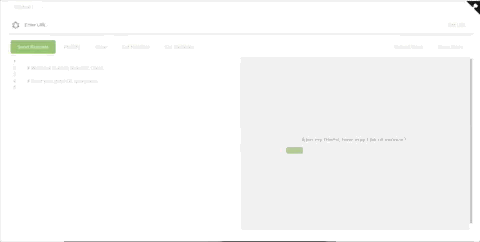

# Altair GraphQL Client

A graphQL client for making graphQL queries to a graphQL server - Postman for GraphQL.

Web app: https://altair-gql.herokuapp.com/

There's a [chrome extension](https://chrome.google.com/webstore/detail/altair-graphql-client/flnheeellpciglgpaodhkhmapeljopja) and a [firefox add-on](https://addons.mozilla.org/en-US/firefox/addon/altair-graphql-client/).

There are apps for [mac, windows and linux users](https://github.com/imolorhe/altair/releases/latest) as well.

## Development server

Run `npm start` for a dev server. Navigate to `http://localhost:4200/`. The app will automatically reload if you change any of the source files.

## Build

Run `npm run build` to build the project. The build artifacts will be stored in the `dist/` directory. Use the `-prod` flag for a production build.

## Generate chrome extension files

Run `npm run build-ext` to build the chrome extension files. The extension files will be stored in the `chrome-extension/` directory.

## Generate electron app

Run `npm run build-electron` to build the electron apps. The apps will be stored in the `electron-builds/` directory.

## Running unit tests

Run `ng test` to execute the unit tests via [Karma](https://karma-runner.github.io).

## Running end-to-end tests

Run `ng e2e` to execute the end-to-end tests via [Protractor](http://www.protractortest.org/).
Before running the tests make sure you are serving the app via `ng serve`.

## Further help

To get more help on working with the project, check out the [Angular CLI README](https://github.com/angular/angular-cli/blob/master/README.md).

## Contributing

1. Fork it!
2. Create your feature branch: `git checkout -b my-new-feature`
3. Commit your changes: `git commit -am 'Add some feature'`
4. Push to the branch: `git push origin my-new-feature`
5. Submit a pull request :D

## Credits

This project was built using [Angular](https://angular.io/), an awesome opensource project from the folks at [Google](https://www.google.com).

The desktop apps were built using [electron](https://electron.atom.io/), another awesome opensource project from the folks at [github](http://www.github.com/).

In case I missed out any other projects, do let me know :)

## License

