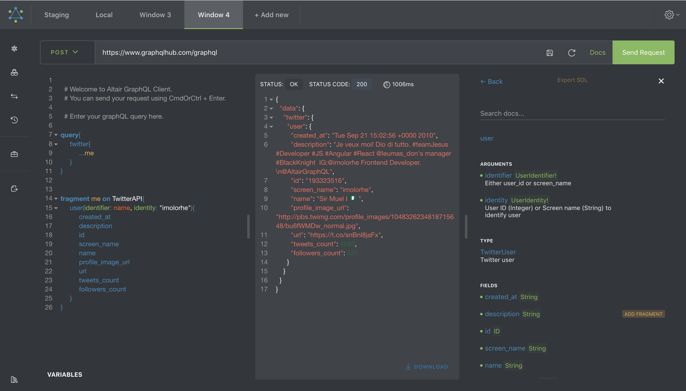

[](https://app.fossa.io/projects/git%2Bhttps%3A%2F%2Fgithub.com%2Fimolorhe%2Faltair?ref=badge_shield)
[](https://crowdin.com/project/altair-gql)

[](https://chrome.google.com/webstore/detail/altair-graphql-client/flnheeellpciglgpaodhkhmapeljopja)
[](https://addons.mozilla.org/en-US/firefox/addon/altair-graphql-client/)
[](https://www.npmjs.com/package/altair-express-middleware)
[](https://snapcraft.io/altair)
[](https://github.com/altair-graphql/altair/releases)
[](https://github.com/altair-graphql/altair/releases)

[](#backers) [](#sponsors)


[Deploying?](.github/DEPLOY.md)

<div align="center" style="text-align: center;">


<h1><a href="https://altair.sirmuel.design/" target="_blank">Altair GraphQL Client</a></h1>

</div>



**Altair** is a beautiful feature-rich GraphQL Client IDE for all platforms. Available for [MacOS, Windows, Linux](https://altair.sirmuel.design/), [Chrome](https://chrome.google.com/webstore/detail/altair-graphql-client/flnheeellpciglgpaodhkhmapeljopja), [Firefox](https://addons.mozilla.org/en-US/firefox/addon/altair-graphql-client/).
It enables you interact with any GraphQL server you are authorized to access from any platform you are on.


_-- the GraphQL IDE that does not require running a web server_


## Features

Altair provides several features that make developing with GraphQL very efficient and friendly. These features include:

- setting **headers**
- setting **variables**
- creating [**environments**](https://sirmuel.design/altair-becomes-environment-friendly-%EF%B8%8F-f9b4e9ef887c)
- viewing **response stats**
- viewing **schema docs**
- advanced **schema docs search**
- dynamically **adding/generating** queries and/or fragments from schema docs
- [**file upload**](https://sirmuel.design/working-with-file-uploads-using-altair-graphql-d2f86dc8261f) via GraphQL
- **autocompletion** of queries
- **autofill** all query fields at cursor
- [**automatic schema refreshing**](https://sirmuel.design/a-better-graphql-developer-experience-with-x-graphql-event-stream-1256aef96f24) using *GraphQL Event Stream* protocol
- **automatic refactoring** of query
- [**prerequest**](https://sirmuel.design/pre-requests-now-available-in-altair-graphql-client-c3b28892059c) scripts
- multiple **windows**, multiple **languages**
- **importing and exporting** collections of queries
- multiple **themes**
- [**plugin system**](https://sirmuel.design/introducing-plugins-in-altair-still-in-beta-b7adb42b466) for extensibility
- and many more features (really there's a **lot more!**).

*See more here: https://altair.sirmuel.design/docs/features*

### Missing feature?

Is there a feature that is missing? You can let us know by creating a [new issue](https://github.com/altair-graphql/altair/issues/new) or you can add the feature by creating a [Pull Request](https://github.com/altair-graphql/altair/blob/master/.github/CONTRIBUTING.md).

## Sponsors
Thanks to all our sponsors for sponsoring this project! Do you use Altair GraphQL client at your company? Consider supporting this project as a major sponsor (primary, gold, silver or bronze) on [open collective](https://opencollective.com/altair/contribute).
### Primary Sponsor
[](https://www.xkoji.dev/)

To be a primary sponsor, [reach out](mailto:sponsor@sirmuel.design) to us.

### Gold Sponsor
Become a [Gold sponsor](https://opencollective.com/altair/contribute/gold-sponsor-27470/checkout) of Altair to appear here.
<!-- ### Silver Sponsor -->

<!-- ### Bronze Sponsor -->

## Usage


For mac users, you can also install using cask:

```
$ brew install --cask altair-graphql-client
```

For linux users, you can also install using [snap](https://snapcraft.io/altair):

```
$ snap install altair
```

For arch linux users, an AUR package [aur/altair](https://aur.archlinux.org/packages/altair/) exists:

```
$ yay -S altair
```

For windows users, you can install using [appget](https://appget.net/packages/i/altair-graphql):

```
$ appget install altair-graphql
```

or [chocolatey](https://chocolatey.org/packages/altair-graphql):

```
$ choco install altair-graphql
```

### Usage with express
You can use altair with an express server using [altair-express-middleware](https://www.npmjs.com/package/altair-express-middleware). Read more about how to use this [here](packages/altair-express-middleware/README.md).

### Usage with koa
You can use altair with a koa server using [altair-koa-middleware](https://www.npmjs.com/package/altair-koa-middleware). Read more about how to use this [here](https://altair.sirmuel.design/docs/integrations/altair-koa-middleware).

### Usage with Fastify

You can use altair with a Fastify server using [altair-fastify-plugin](https://www.npmjs.com/package/altair-fastify-plugin). Read more about how to use this [here](packages/altair-fastify-plugin/README.md).

### Usage with Laravel (PHP)
You can use altair in a Laravel project using [xkojimedia/laravel-altair-graphql](https://packagist.org/packages/xkojimedia/laravel-altair-graphql):

```console
$ composer require xkojimedia/laravel-altair-graphql
```

*You can find other available integrations here: https://altair.sirmuel.design/docs/integrations*

### Configuration Options
When using a custom instance of Altair, there are [couple of options](https://github.com/altair-graphql/altair/blob/master/packages/altair-app/src/app/modules/altair/config.ts#L9) you can use to customize Altair based on your needs:

- `endpointURL` `string` - URL to set as the server endpoint
- `subscriptionsEndpoint` `string` - URL to set as the subscription endpoint
- `initialSubscriptionsProvider` `"websocket" | "graphql-ws" | "app-sync" | "action-cable"` - Initial subscriptions provider
- `initialQuery` `string` - Initial query to be added
- `initialVariables` `string` - Initial variables to be added (in JSON format) e.g. `'{ "var1": "first variable" }'`
- `initialPreRequestScript` `string` - Initial pre-request script to be added e.g. `'altair.helpers.getEnvironment("api_key")'`
- `initialHeaders` `IDictionary` - Initial headers object to be added
```js
{
  'X-GraphQL-Token': 'asd7-237s-2bdk-nsdk4'
}
```
- `initialEnvironments` `IInitialEnvironments` - Initial Environments to be added
```js
{
  base: {
    title: 'Environment',
    variables: {}
  },
  subEnvironments: [
    {
      title: 'sub-1',
      variables: {}
    }
  ]
}
```
- `instanceStorageNamespace` `string` - Namespace for storing the data for the altair instance. Use this when you have multiple altair instances running on the same domain. e.g. `'altair_dev_'`

Example usage:
```js
AltairGraphQL.init({
  endpointURL: 'https://www.example.com/graphql',
  initialVariables: '{ "username": "imolorhe" }',
});
```

## Supported Browsers

Altair has been tested in the latest versions of Google Chrome and Mozilla Firefox. It might not work as expected in other browsers like Safari and Edge.

## Community 🙏🏾

You can learn more about how to get help [here](.github/community.md).

## Contributing

Would you like to help with translations? https://altair-gql-translate.surge.sh/ [Click here](https://crwd.in/altair-gql).

<div align="center" style="text-align: center;">
  
[](https://opencollective.com/altair/donate)

</div>

<a href="https://opencollective.com/altair#sponsors" target="_blank"></a>

Learn more about contributing to Altair [here](.github/CONTRIBUTING.md) and [here](https://altair.sirmuel.design/docs/contributing.html).

## Development

Read more [here](.github/development.md).

## License
[](https://app.fossa.io/projects/git%2Bhttps%3A%2F%2Fgithub.com%2Fimolorhe%2Faltair?ref=badge_large)
