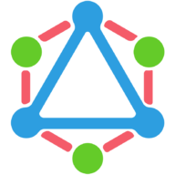

<!--  -->

 

  

  <h1><a href="https://altairgraphql.dev/" target="_blank">Altair GraphQL Client</a></h1>

**Altair** is a beautiful feature-rich GraphQL Client IDE for all platforms. Altair GraphQL Client helps you debug GraphQL queries and implementations - taking care of the hard part so you can focus on actually getting things done.

[altairgraphql.dev](https://altairgraphql.dev/)

## Documentation

Get started with Altair by reading the [documentation](https://altairgraphql.dev/docs/).

## Sponsors

Thanks to all our sponsors for sponsoring this project! Do you use Altair GraphQL client at your company? Consider supporting this project as a sponsor (primary, gold, silver or bronze) on [open collective](https://opencollective.com/altair/contribute).

### Primary Sponsor

To be a primary sponsor, [reach out](mailto:sponsor@sirmuel.design) to us.

### Gold Sponsor

Become a [Gold sponsor](https://opencollective.com/altair/contribute/gold-sponsor-27470/checkout) of Altair to appear here.

<!-- ### Silver Sponsor -->

<!-- ### Bronze Sponsor -->

### Bronze Sponsor

  

### Other Sponsors

  

## Community 🙏🏾

You can learn more about how to get help [here](.github/community.md).

## Contributing

Would you like to help with translations? https://altair-gql-translate.surge.sh/ [Click here](https://crwd.in/altair-gql).

  

Learn more about contributing to Altair [here](.github/CONTRIBUTING.md) and [here](https://altairgraphql.dev/docs/contributing.html).

## Development

Read more [here](.github/development.md).

## Deployment

### API

#### Docker

The docker image can be built from the [Dockerfile](./Dockerfile) at the root of the repo.

#### Hostinger

#### Digitalocean

#### Vercel

#### Render

## License

