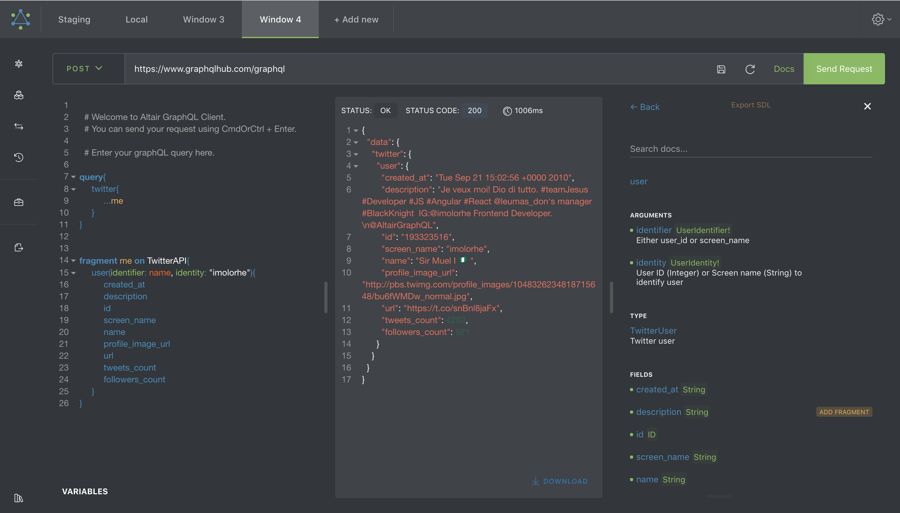

[](https://travis-ci.org/imolorhe/altair)
[](#contributors)
[](https://ci.appveyor.com/project/imolorhe/altair/branch/staging)
[](https://app.fossa.io/projects/git%2Bhttps%3A%2F%2Fgithub.com%2Fimolorhe%2Faltair?ref=badge_shield)
[](https://crowdin.com/project/altair-gql)
[](https://gitter.im/altair-graphql/Lobby)

[](https://chrome.google.com/webstore/detail/altair-graphql-client/flnheeellpciglgpaodhkhmapeljopja)
[](https://chrome.google.com/webstore/detail/altair-graphql-client/flnheeellpciglgpaodhkhmapeljopja)
[](https://chrome.google.com/webstore/detail/altair-graphql-client/flnheeellpciglgpaodhkhmapeljopja)
[](https://addons.mozilla.org/en-US/firefox/addon/altair-graphql-client/)
[](https://www.npmjs.com/package/altair-express-middleware)
[](https://snapcraft.io/altair)
[](https://github.com/imolorhe/altair/releases)
[](https://github.com/imolorhe/altair/releases)

[](#backers) [](#sponsors)


[](https://greenkeeper.io/)
[](https://lernajs.io/)
[](https://houndci.com)

[Deploying?](DEPLOY.md)

<div align="center" style="text-align: center;">


<h1><a href="https://altair.sirmuel.design/" target="_blank">Altair GraphQL Client</a></h1>

<hr>

[](https://opencollective.com/altair/donate)

</div>

Would you like to help with translations? https://altair-gql-translate.surge.sh/ [Click here](https://crwd.in/altair-gql).



A graphQL client for making graphQL queries to a graphQL server - similar to Postman but for GraphQL.

Web app: https://altair-gql.sirmuel.design/

There's a [chrome extension](https://chrome.google.com/webstore/detail/altair-graphql-client/flnheeellpciglgpaodhkhmapeljopja) and a [firefox add-on](https://addons.mozilla.org/en-US/firefox/addon/altair-graphql-client/).

There are apps for [mac, windows and linux users](https://altair.sirmuel.design/) as well.

You can also install using cask:

```
$ brew cask install altair-graphql-client
```

For linux users, you can also install using [snap](https://snapcraft.io/altair):

```
$ snap install altair
```

For arch linux users, an AUR package [aur/altair](https://aur.archlinux.org/packages/altair/) exists:

```
$ yay -S altair
```

### Usage with express
You can use altair with an express server using [altair-express-middleware](https://www.npmjs.com/package/altair-express-middleware). Read more about how to use this [here](packages/altair-express-middleware/README.md).

### Usage with koa
You can use altair with a koa server using [altair-koa-middleware](https://www.npmjs.com/package/altair-koa-middleware). Read more about how to use this [here](https://altair.sirmuel.design/docs/integrations/altair-koa-middleware).

## Features

- Headers
- Variables
- Response Stats
- Documentation (via introspection)
- Documentation search
- Syntax highlighting
- Error highlighting
- Add queries and fragments from documentation

- Upload files via GraphQL
- Autocompletion of fields, arguments, types, etc
- Autofill all fields at cursor
- Schema auto refresh
- Prettify Query
- Compress Query
- History of recent queries
- Multiple Windows
- GraphQL Subscriptions (with desktop notifications)
- Import/Export Queries
- Multiple Languages
- Light and Dark themes

See more here: https://altair.sirmuel.design/docs/features

### Missing feature?

Is there a feature that is missing? You can let us know by creating a [new issue](https://github.com/imolorhe/altair/issues/new) or you can add the feature by creating a [Pull Request](https://github.com/imolorhe/altair/blob/staging/.github/CONTRIBUTING.md).

## Development server

Run `yarn start` for a dev server. Navigate to `http://localhost:4200/`. The app will automatically reload if you change any of the source files.

## Build

Run `yarn build` to build the project. The build artifacts will be stored in the `dist/` directory. Use the `-prod` flag for a production build.

## Generate chrome extension files

Run `yarn build-ext` to build the chrome extension files. The extension files will be stored in the `chrome-extension/` directory.

## Generate electron app

Run `yarn build-electron` to build the electron apps. The apps will be stored in the `electron-builds/` directory.

## Updating docs

Run `bundle exec jekyll serve`.

## Running tests

Run `yarn test` to execute the unit tests via [Karma](https://karma-runner.github.io) and the end-to-end tests via [Protractor](http://www.protractortest.org/).


## Further help

To get more help on working with the project, check out the [Angular CLI README](https://github.com/angular/angular-cli/blob/master/README.md).

### Contributors

This project exists thanks to all the people who contribute. [[Contribute](.github/CONTRIBUTING.md)].
<a href="graphs/contributors"></a>

## Backers

Thank you to all our backers! 🙏 [[Become a backer](https://opencollective.com/altair#backer)]

<a href="https://opencollective.com/altair#backers" target="_blank"></a>


## Sponsors

Support this project by becoming a sponsor. Your logo will show up here with a link to your website. [[Become a sponsor](https://opencollective.com/altair#sponsor)]

<a href="https://opencollective.com/altair#sponsors" target="_blank"></a>


## License
[](https://app.fossa.io/projects/git%2Bhttps%3A%2F%2Fgithub.com%2Fimolorhe%2Faltair?ref=badge_large)

## Contributors

Thanks goes to these wonderful people ([emoji key](https://github.com/all-contributors/all-contributors#emoji-key)):

<!-- ALL-CONTRIBUTORS-LIST:START - Do not remove or modify this section -->
<!-- prettier-ignore -->
<table>
  <tr>
    <td align="center"><a href="https://github.com/DaniloCaruso"><br /><sub><b>Danilo Caruso</b></sub></a><br /><a href="#translation-DaniloCaruso" title="Translation">🌍</a></td>
    <td align="center"><a href="https://github.com/IgorSzymanski"><br /><sub><b>Igor Szymanski</b></sub></a><br /><a href="#translation-IgorSzymanski" title="Translation">🌍</a></td>
    <td align="center"><a href="https://github.com/kporten"><br /><sub><b>Kevin Porten</b></sub></a><br /><a href="#translation-kporten" title="Translation">🌍</a></td>
    <td align="center"><a href="https://0xabcdef.com/"><br /><sub><b>JongChan Choi</b></sub></a><br /><a href="#translation-disjukr" title="Translation">🌍</a></td>
    <td align="center"><a href="https://twitter.com/alexey_rodionov"><br /><sub><b>Alexey Rodionov</b></sub></a><br /><a href="https://github.com/imolorhe/altair/commits?author=FluorescentHallucinogen" title="Documentation">📖</a></td>
    <td align="center"><a href="https://github.com/kurisutofu"><br /><sub><b>kurisutofu</b></sub></a><br /><a href="#translation-kurisutofu" title="Translation">🌍</a></td>
    <td align="center"><a href="https://github.com/Claercio"><br /><sub><b>Claércio Santos</b></sub></a><br /><a href="#translation-Claercio" title="Translation">🌍</a></td>
  </tr>
  <tr>
    <td align="center"><a href="https://janjaromirhorak.cz/"><br /><sub><b>jenda</b></sub></a><br /><a href="#translation-janjaromirhorak" title="Translation">🌍</a></td>
    <td align="center"><a href="https://github.com/pcharbon70"><br /><sub><b>pcharbon70</b></sub></a><br /><a href="#translation-pcharbon70" title="Translation">🌍</a></td>
    <td align="center"><a href="https://github.com/juca-cruz"><br /><sub><b>Juan Cruz</b></sub></a><br /><a href="#translation-juca-cruz" title="Translation">🌍</a></td>
    <td align="center"><a href="https://github.com/victormihaita"><br /><sub><b>Victor Mihaita</b></sub></a><br /><a href="#translation-victormihaita" title="Translation">🌍</a></td>
    <td align="center"><a href="https://github.com/qonn"><br /><sub><b>Furqan Anas</b></sub></a><br /><a href="https://github.com/imolorhe/altair/commits?author=qonn" title="Documentation">📖</a></td>
  </tr>
</table>

<!-- ALL-CONTRIBUTORS-LIST:END -->

This project follows the [all-contributors](https://github.com/all-contributors/all-contributors) specification. Contributions of any kind welcome!
